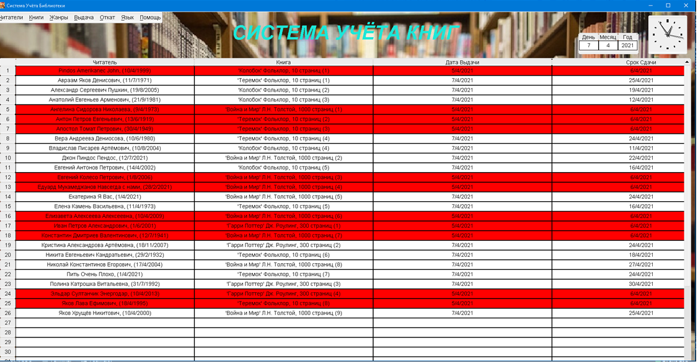

**Library-Rs**
--------------

[](https://www.rust-lang.org)

## **Developer**
[Paranid5](https://github.com/dinaraparanid)

## **About project**:
This is a project that aims to create a system for issuing books in libraries

*[Documentation](https://docs.rs/binartree/1.1.9/booklibrs/)*

### **Preview**

[video](preview.webm)



### **Description**
First of all, you will see a table.
It contains all readers in ascending order and their reading status (book / start date / finish date)
In the main menu (on the left top corner) you will see 6 sub menus: "Readers", "Books", "Giveaway", "Restore", "Language", "Help".

**Reader menu**: contains all actions that you can do with readers: Add, Remove, Change 1-st name, 2-nd name, mid. Name, get information.
There are also two types of getting info: with books that reader is reading now and with all books that reader read
(all existing books in a library, if you delete book, it will not be shown.) 
All these actions require your input. But you can simply click on reader you need in the main table and all needed action will be there
(except adding reader, that's can't handle without input)

**Book menu**:
1) Add books (if a book in a library, it'll add new books, else it'll create new books in a library)
2) Remove a book. You can remove only one book in this action. Requires number of books.
3) Remove all specific books. It'll remove all books with the same title, author and number of pages.
4) Change title, author, number of pages. I think it'll be obvious.
5) Change the book's location.
   You'll change cabinet and shelf where book is located.
   I don't know anything about your library, so I can't
   control your input

6) Get type book's information. As for reader, you'll get a window with info and all actions for it.
7) Get the current book's information. You'll get info window about a current book. Also you can change location (cabinet and shelf) of book.
8) List of all books by authors. Window with all books sorted by authors. Authors sorted by ascending.
9) List of all books.

**Genres menu**:
1) List of all books by genres. Sort all books by genres.
2) Add genre / Remove genre. By default, it'll be no genre, so you need to add it. It can be anything, so you can use your imagination :)
3) Customize book genres. You'll get a window with genres. You need to choose genre. If a book has some genres, it'll be a check mark near genre

**Giveaway menu** is a menu for giving and returning books.
1) Give a book.
   Requires to be input for reader and book.
   In the end, you need to choose return date.
   Also, you can do it in reader info
   (or just click on reader)
2) Get a book from reader. Requires reader input. Also, you can do it in reader info or click on reader.
3) Change return date. You can also click on return date in the main table and change it.

**Restore menu**:
1) Restore previous data. Also, you can use Ctrl-Z.
2) Restore next date. Also, you can use Ctrl-Shift-Z.

In **language menu** you can choose language.
My languages are Russian and English, so I don't add others,
so I hope your english is not worse than mine :D

In the **Help menu**, you can read the same things if you forgot something.

### **Stack**

<ul>
   <li>Rust 2021 edition</li>
   <li>FLTK-rs</li>
   <li>Yaml-Rust</li>
</ul>

## **Setup**

1. Install [all necessary libraries for FLTK](https://fltk-rs.github.io/fltk-book/Setup.html)
2. Clone from git and compile project:

```shell
git clone https://github.com/dinaraparanid/Library_rs.git
cd Library_rs
cargo run --release
```

## **License**
*MIT or Apache-2.0*
